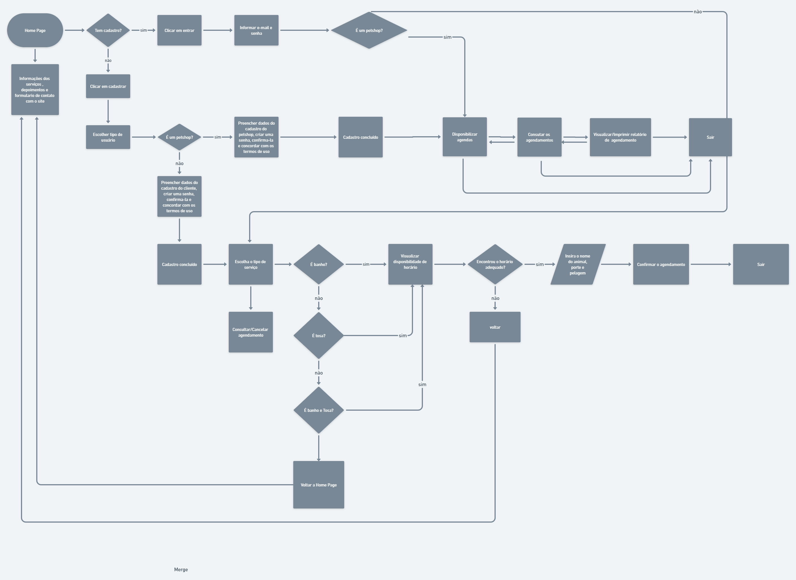

# Projeto de Interface

Pré-requisitos: <a href="2-Especificação do Projeto.md"> Documentação de Especificação</a>

A montagem da interface do sistema foi cuidadosamente desenvolvida para proporcionar maior conforto ao usuário, para isso estamos estabelecendo foco em acessibilidade, usabilidade e agilidade, todas as telas são projetadas para funcionamento em qualquer dispositivo.

## Diagrama de Fluxo

Conforme pode ser visto, a *Figura 5* mostra o diagrama de fluxo de interação do usuário pelas telas do sistema. Cada uma das telas deste fluxo é detalhada na seção de Wireframes que será desenvolvido. 

|FLUXO DO USUÁRIO| DESCRIÇÃO | RF |
|--|-------------------------------------------------------|----------------------|
|Home | A home da aplicação sera reponsavel por ligar as funcionalidades principais do sistema| RF-01 |
|Cadastro de usuário | O usuário deve conseguir realizar o cadastro conforme o  tipo de usuário| RF-01 |
|Agenda Cliente| O cliente deverá visualizar a agenda, preços  e selecionar data e horários disponiveis| RF-004|
|Agenda Petshop| O petshop deverá visualizar, adicionar e ditar datas e horários| RF-005 |
|Novo agendamento| O cliente deverá inserir dados do pet e adicionar serviços| RFs-07 e 13 |
|Minha conta| O usuário deverá visualizar suas agendas e status do agendamento| RFs-08 e 10 |

## Wireframes

Conforme fluxo de telas do projeto amostrado no item anterior, as telas do sistema são apresentadas em detalhes nos itens que se seguem. Todas essas telas têm uma estrutura comum que é apresentada na *Figura 6*. Nesta estrutura existem 3 grandes blocos, descritos a seguir. São eles:
- **Cabeçalho** - local onde são dispostos elementos fixos de identidade (logo) e icone de usuário;   
- **Conteúdo** - apresenta o conteúdo da tela em questão;   
- **Rodapé** - apresenta detalhes adicionais sobre o projeto e um formulario de contato.

## Tela - LandingPage / Login 
A tela inicial ou LandingPage apresentada na *Figura 7* permite visualizar notícias e informações relevantes sobre o projeto na extensão da página e ao clicar no icon de usuário abre um modal conforme explicado no tópico *Modal - Login* que segue.   

Figura 7 – LandingPage

## Modal - Login 
O modal que se abre ao clicar no icon de usuário no canto superior direito do cabeçalho permite ao usuário fazer login na aplicação, preenchendo suas credenciais conforme orientado. Além disso, o usuário pode ser direcionado para se cadastrar na opção “Não tem uma conta?” e para redefinir a senha da conta na opção "Esqueceu sua senha?". O modal em questão pode ser visualizado conforme *Figura 8*.

Figura 8 – Modal Login

## Fluxo de Telas - Cadastro de Usuário 
O fluxo de *Cadastro de Usuário* ilustrado na *Figura 9* permite ao usuário se cadastrar na aplicação caso este ainda não possua uma conta, seguindo um formulário solicitando informações obrigatórias de acordo com o tipo de perfil a ser criado.

Figura 9 – Fluxo de Cadastro de Usuário. 

Figura 10 – Fluxo de Cadastro de Usuário Cliente. 

Figura 11 - Fluxo de Cadastro de Usuário Petshop

## Fluxo de Telas - Agenda
O fluxo de "Agenda" permite o usuário selecionar uma data e visualizar os horários disponiveis, ilustrado na *Figura 12*

Figura 11 - Fluxo de Agenda

## Fluxo de Telas - Criar Agendamento
O fluxo "criar agendamento" permite o usuário criar um agendamento e inserir os dados do pet 

Figura 11 - Fluxo de Criar Agendamento

## Fluxo de Telas - Minha Conta Cliente
O fluxo "minha conta cliente" permite o usuário visualizar suas agendas e status e cancelar um agendamento

Figura 12 - Fluxo Minha Conta Cliente

## Fluxo de Telas - Minha Conta Petshop
O fluxo "minha conta cliente" permite o usuário visualizar suas agendas e status e cancelar um agendamento

Figura 13 - Fluxo Minha Conta Petshop

São protótipos usados em design de interface para sugerir a estrutura de um site web e seu relacionamentos entre suas páginas. Um wireframe web é uma ilustração semelhante do layout de elementos fundamentais na interface.
 
> **Links Úteis**:
> - [Protótipos vs Wireframes](https://www.nngroup.com/videos/prototypes-vs-wireframes-ux-projects/)
> - [Ferramentas de Wireframes](https://rockcontent.com/blog/wireframes/)
> - [MarvelApp](https://marvelapp.com/developers/documentation/tutorials/)
> - [Figma](https://www.figma.com/)
> - [Adobe XD](https://www.adobe.com/br/products/xd.html#scroll)
> - [Axure](https://www.axure.com/edu) (Licença Educacional)
> - [InvisionApp](https://www.invisionapp.com/) (Licença Educacional)
